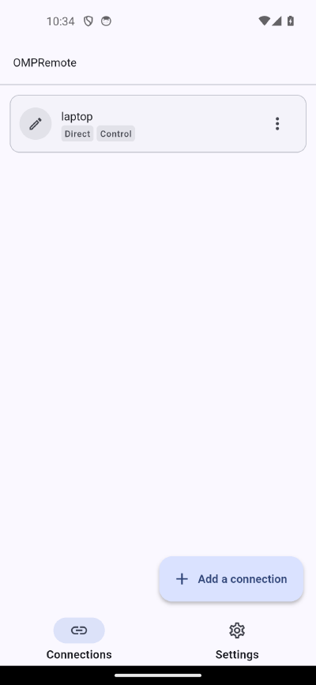
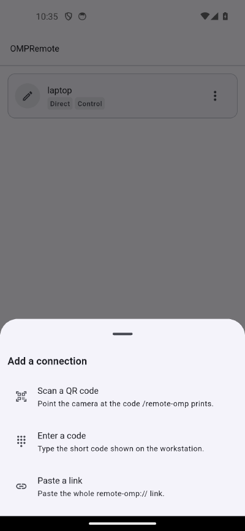
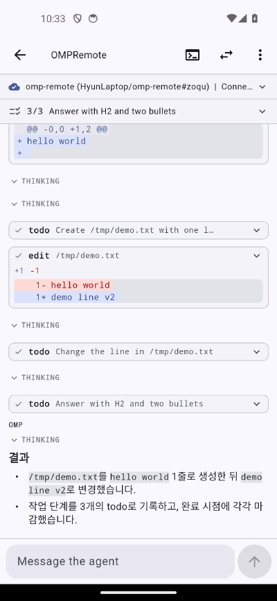
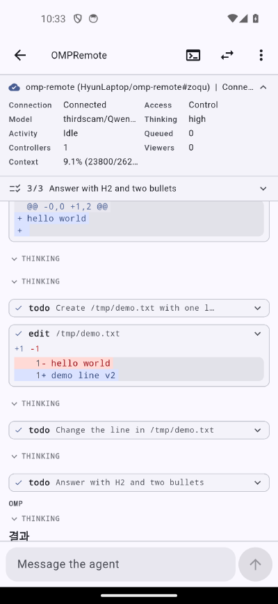
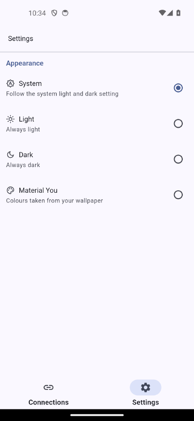

# omp-remote

Drive a running [oh-my-pi](https://github.com/can1357/oh-my-pi) coding session
from your phone. Read the stream as it happens, send prompts, and answer the
questions the agent would otherwise ask at your keyboard.

| Directory | What it is                                                          |
| --------- | ------------------------------------------------------------------- |
| `plugin/` | An omp extension. Loads into a session and serves it.               |
| `relay/`  | A Go WebSocket hub in Docker, for when the phone cannot reach you.  |
| `app/`    | OMPRemote, a Flutter client for Android and iOS.                    |

| | | |
| :---: | :---: | :---: |
|  |  |  |
| Saved connections | One action, three ways to pair | The session as a log |
|  |  | |
| Model, thinking, context, viewers | Appearance, including Material You | |

## Two ways to connect

**Direct.** The plugin listens on port 8788 and the phone dials it. No relay,
no third party, nothing to deploy. Use this on a LAN or over Tailscale. This is
the path to start with.

**Relayed.** Both the workstation and the phone dial out to a relay you run,
so neither needs an inbound port. Use this when the phone cannot reach the
workstation at all.

The app speaks one protocol either way and does not care which it is on. The
wire format is in [`docs/protocol.md`](docs/protocol.md).

## Install

### 1. The plugin

Needs omp 18.1.11 or newer.

```sh
omp plugin install github:heavycaffeiner/omp-remote
```

That is the whole installation. The plugin loads itself in every session
afterwards, starts its local server on port 8788, and is ready to pair.
Everything below is optional.

To pin a version or a branch, append a ref:

```sh
omp plugin install github:heavycaffeiner/omp-remote#v0.0.1
```

Upgrade and removal go the same way:

```sh
omp plugin upgrade omp-remote
omp plugin uninstall omp-remote
```

To work on the plugin instead of just using it, clone it and load the working
copy, which takes precedence over anything installed:

```sh
git clone https://github.com/heavycaffeiner/omp-remote.git
cd omp-remote && bun install
omp --extension .
```

### 2. The app

Prebuilt Android APKs are attached to each
[release](https://github.com/heavycaffeiner/omp-remote/releases). Download
`ompremote-<version>.apk` and install it.

To build it yourself, or to run on iOS:

```sh
cd app
flutter pub get
flutter run -d <device-id>
```

Android needs the Android SDK. iOS needs macOS with Xcode, plus
`cd ios && pod install`.

### 3. The relay, only if you need one

Skip this if the phone can already reach your workstation.

The relay ships as a container image for `linux/amd64` and `linux/arm64`.
Generate three tokens, then run it:

```sh
head -c 32 /dev/urandom | base64   # once per token
```

```sh
docker run -d -p 8787:8787 \
  -e OMP_RELAY_AGENT_TOKEN=... \
  -e OMP_RELAY_CONTROL_TOKEN=... \
  -e OMP_RELAY_VIEWER_TOKEN=... \
  ghcr.io/heavycaffeiner/omp-remote-relay:latest
```

```sh
curl localhost:8787/healthz     # expect: ok
```

To build it from source instead, `relay/compose.yaml` reads the same three
variables from a `.env` file:

```sh
cd relay && cp .env.example .env
docker compose up -d --build
```

Put TLS in front of it and hand out `wss://` URLs. Tokens travel in the
upgrade request and the frames are your session content.

## Use it

Start omp with the plugin loaded, then:

```
/remote
```

A QR code appears. Scan it with the app and you are connected.

If the camera is not an option, the same output carries a six-character code:

```
    Address:  100.64.0.3:8788
    Code:     HZE6VD
```

In the app choose "Enter a code" and type those. The code works once and
expires in five minutes. This beats copying a 64-character token by hand,
which is what the raw link would otherwise ask of you.

```
/remote            a control code, link, and QR for this session
/remote viewer     a read-only code and link, for someone who should only watch
/remote relay      force the relay form even when direct is available
/remote status     transport status: what is connected and who is attached
/remote config     see and change the settings
```

The plugin picks a reachable address for you, preferring Tailscale, then your
LAN. When several would work it prints them all and you pick.

### Several sessions at once

Run omp in as many directories as you like. They all share one port: the
first session to bind it serves the rest, and the others attach to it. The
app asks that one address and sees every session, then switches between them.
If the session holding the port exits, another takes over within seconds.

On a relay every session appears in one roster and you pick from it.

### What you can do from the phone

Read the transcript as it streams, including thinking blocks and tool calls.
Send a prompt, steer a running turn, or abort it. Change the model or the
thinking level. Compact the context. Watch the todo list.

You can also answer the agent. When it asks a question through the `ask` tool,
that question arrives on your phone and your answer completes the tool call.
The turn continues without you touching the keyboard.

### Watching without touching

A viewer link connects read-only. Viewers see the whole stream and any pending
question, but every command and answer they try is refused. The role comes from
which token authenticated the connection, so a viewer cannot promote itself.

Viewer links only exist for direct pairing out of the box. Over a relay they
need the relay's own viewer token, set with
`/remote config relay viewer <token>`.

## Configuration

All optional. Unconfigured, the plugin serves this workstation directly on
port 8788 and uses no relay, which is what pairing over your LAN or Tailscale
needs.

Run `/remote config` in a session to see the current settings and how to
change each of them. There are no environment variables; everything is stored
in `~/.omp/agent/omp-remote.json` at mode 0600, because it holds credentials.

| Setting          | Default   | Meaning                                       |
| ---------------- | --------- | --------------------------------------------- |
| `relay`          | absent    | Also route through a relay, so no inbound port is needed |
| `local.enabled`  | `true`    | Serve this workstation directly               |
| `local.port`     | `8788`    | The port every session on the machine shares  |
| `local.bind`     | `0.0.0.0` | Direct server bind address                    |
| `allowBash`      | `false`   | Let a control client run shell commands       |
| `remoteApproval` | `false`   | Forward tool approvals to the phone           |

```
/remote config relay wss://relay.example/agent <agent-token>
/remote config relay control <relay-control-token>
/remote config relay off
```

## When the app will not connect

The status band names the reason and keeps it on screen; the icon next to it
retries immediately instead of waiting out the backoff.

| What the band says | What it means |
| ------------------ | ------------- |
| `host unreachable: connection timed out` | The workstation is dropping the port. Almost always its own firewall: the plugin binds every interface, so the listener itself is fine. |
| `port refused: nothing is listening on that port` | Right address, wrong port, or that session is not serving. |
| `token rejected: the server did not accept this token` | The link expired or belongs to a different session. Run `/remote` again. |
| `host unreachable: could not resolve the address` | The address in the link is not resolvable from the phone's network. |

A timeout on a LAN address is the common one, and the fix is on the
workstation:

```sh
sudo firewall-cmd --add-port=8788/tcp        # firewalld, this boot only
sudo ufw allow 8788/tcp                      # ufw
```

Tailscale traffic usually arrives on an interface the firewall already
trusts, so pairing over a Tailscale address often works with no change at
all. `/remote` prints these same commands under the pairing code.

## Security

**The pairing link is a credential.** It carries a bearer token for the role it
names. It is rendered to your terminal and never logged or written to disk, but
anyone who reads the QR gets that access.

**The agent token is a workstation credential.** Anyone holding it can register
as any agent id on your relay. It is not a client token and the relay will not
accept it as one.

**`bash` is off by default.** Turning it on lets whoever holds the control
token run shell commands on your machine. That is the whole point of the flag,
so decide deliberately.

**Approval forwarding is deny-only, and off by default.** A remote `deny`
genuinely blocks a tool. A remote `allow` only means the plugin does not
object: omp's own approval gate still runs and still has to be answered at the
workstation. The app labels these accordingly.

## Limits

Known, and unlikely to change without upstream API work.

- **Four commands, not eighty-four.** The extension API exposes no way to
  invoke a slash command, and submitting `/name` as a prompt sends it to the
  model as text. The app offers `todo`, `compact`, `btw`, and `omfg`, each
  reimplemented through an API that is reachable. Everything else stays at
  the workstation.
- **The pending queue cannot be edited from the phone.** There is one queue
  and omp owns it; `ExtensionContext` reports only whether something is
  waiting. A mid-turn prompt still arrives at the next step boundary, the
  same as one typed at the workstation.
- **Some settings are unreachable.** `set_steering_mode`,
  `set_follow_up_mode`, `set_interrupt_mode`, `cycle_model`, `stats`,
  `new_session`, `switch_session`, and `branch` live on a session object
  extensions never receive. Each fails with an explicit error rather than
  pretending to work.
- **Prompts from other extensions are not forwarded.** Only this plugin's own
  tools, the shadowed `ask`, and tool denials reach your phone.

## Development

```sh
bun install && bun run typecheck && bun run test   # plugin
cd relay && go test ./... && go vet ./...          # relay
cd app   && flutter analyze && flutter test        # app
```

Go 1.27, Bun 1.4, Flutter 3.47 with Dart 3.13.

### Releasing

Pushing a `v*` tag builds the relay image for `linux/amd64` and `linux/arm64`,
builds a signed APK, and attaches it to a GitHub release. The signing key is
held in repository secrets; the workflow fails rather than falling back to the
debug key, since a debug-signed APK cannot be upgraded in place later.

## License

MIT. See [LICENSE](LICENSE).
